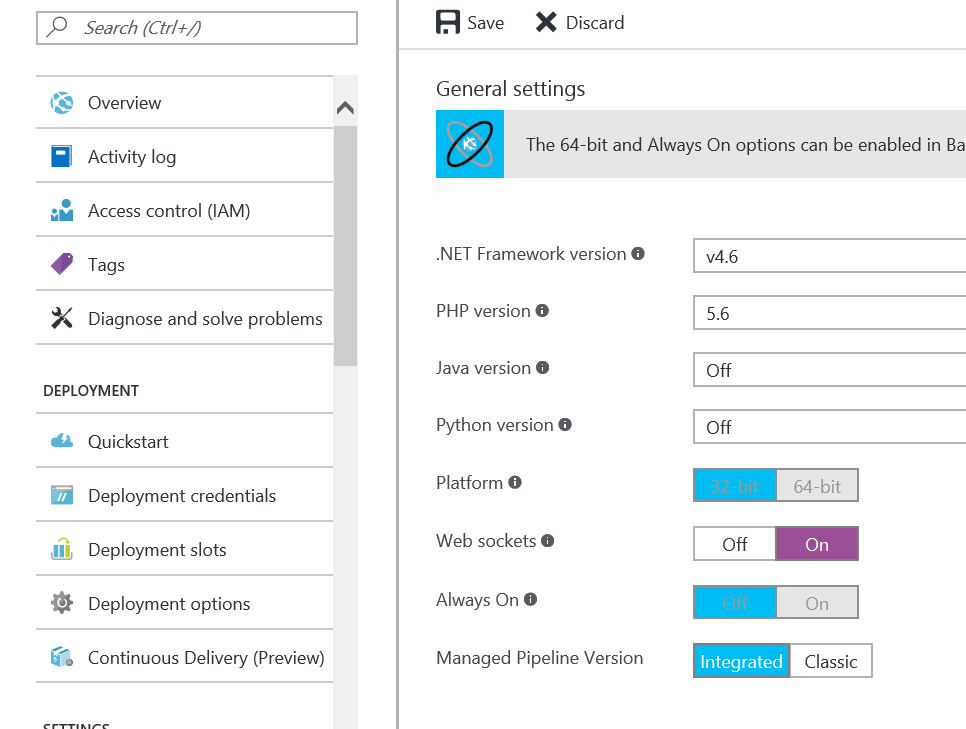
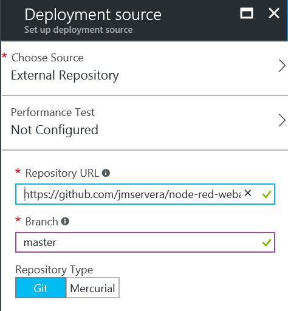
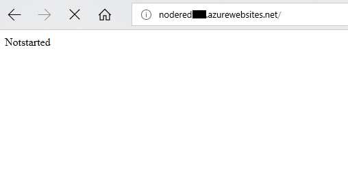
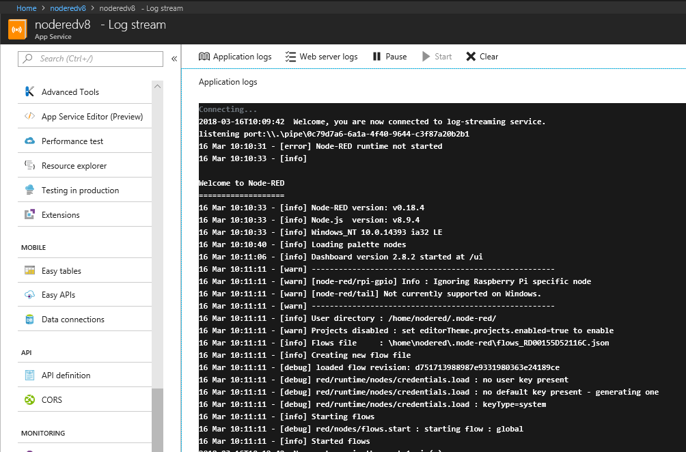

# node-red-azure-webapp
A webapp wrapper for running node-red in an Azure Web App.
To use it just:

1. Deploy to Azure with this button:

<!-- Or... 

1. Create an Azure Web App
1. Open the settings and activate **Web sockets**

    

    **Figure 1** Activate Web sockets
1. Configure the deployment options as an *External repository* pointing to [https://github.com/MaPaSoTo/node-red-webapp.git](https://github.com/jmservera/node-red-azure-webapp.git)

    

    **Figure 2** External Repository

> This project currently uses a workaround to avoid a small problem caused with `child_process.execFile`: it uses a fake npm.cmd that points to the real one.

## Usage

Wait until everything is deployed before opening the website, during the deployment a script is executed to download this repo and install all the needed modules. If you see this screen just wait about 30 seconds to let the Node-RED app start:

**Figure 3** Not Started Site

You can see the live log in the Azure Portal, in the *Log stream* tab:

**Figure 4** Application logs stream
-->

It comes with some cool nodes preinstalled:

* Dashboard (create an awesome ui and see it in https://yoursite/ui )
* Azure IoT Central
* Azure IoT Device
* Random
* Counter

## Securing your deployment

I use a ultra-highly complex password (a hint: it's not 1234545678) in this actual configuration
<!-- To secure this deployment and add an admin password edit the `settings.js` file. -->

## Version History

* v0.0.1
  * First test with basic nodes
* v0.0.2
  * Deploy to Azure Button
  * Add cognitive services
* v0.0.3
  * Update Node-Red version to 0.18.4
* v1.0.0
  * Update Nodejs to 8.9.4
  * Make Nodejs version configurable
  * Add Swagger Node
* v2.0.0-beta
  * Update Nodejs to 12
  * Update Node-red to 1.0.6
  * Update azureiothubnode to 0.5.2
  * Update cognitive-services 0.5.5
  * Update dashboard 2.21.0
  * Update node-swagger 0.1.9
* v3.0.0-beta
   * Update to node-red 3.0.2
   * Install node-red-dashboard: 3.2.0 (aktuell:3.3.1)
   * Install node-red-contrib-azure-iot-central to 1.5.4 (latest)
   * Install node-red-contrib-azure-iot-device: 0.2.6 (latest)
   * Install node-red-node-random: 0.4.1 (latest)
   * Install ttb-node-red-counter: 0.1.0 (latest)
   * Removed azureiothubnode to 0.5.2
   * Removed cognitive-services 0.5.5
   * Removed dashboard 2.21.0
   * Removed node-swagger 0.1.9
* v3.0.1-beta 
   * Add login protection ("Nij6kk!#")
   * Add injection moulding machine as pre-installed flow
* v3.0.2-beta
   * Added node-red-contrib-aedes (latest)
   * Added node-red-contrib-loop (latest)
   * Added node-red-contrib-opcua (latest)
 
  
